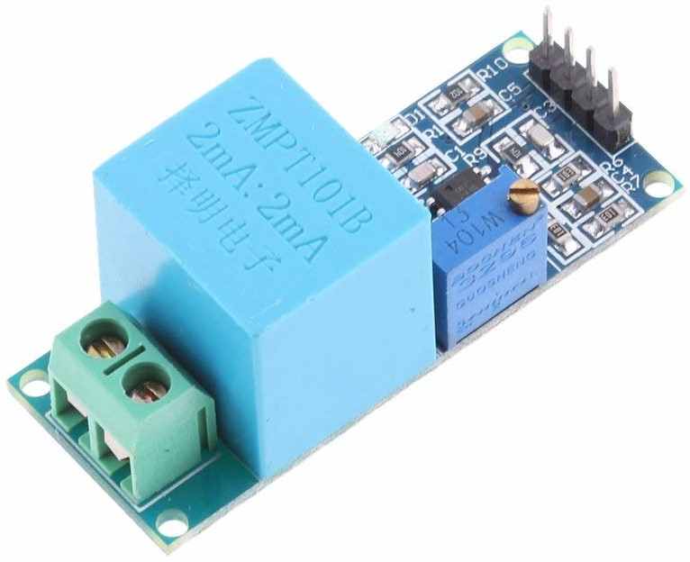

# Arduino-AC-detector
Very simple lib to let you know if there is any alternative current on an analog pin of your Arduino.

Usefull with transformers like [this one](https://www.amazon.fr/gp/product/B071ZGJ6T1/).

See [example](examples/AC-example/AC-example.ino) to learn how to use.